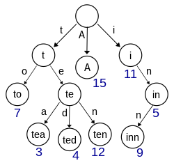

# README: Projet ALGOPROG

## Explication de notre démarche

## Bibliothèqes

Ce dépôt contient trois bibliothèques programmées en C :

hash.h, trie.h et linked_list.h.

# hash.h

La bibliothèque hash.h implémente une table de hachage pour stocker et rechercher des mots en temps quasi constant. Elle utilise une liste chaînée pour gérer les collisions. Les fonctions suivantes sont disponibles :

    void initializeHashTable(HashTable *hashTab);
    //initialise une table de hachage vide

    void loadDictionaryFromFile(HashTable* hashTab, const char* dictionaryFileName);
    //charge un dictionnaire à partir d'un fichier et l'ajoute à la table de hachage

    void insertElementToHashTable(HashTable* hashTab, char* word);
    //ajoute un élément à la table de hachage

    bool checkExistenceWordInDictionary(HashTable* hashTab, char * word);
    //vérifie si un mot existe dans la table de hachage
    
    unsigned long getHashValue(char *string);
    //calcule la valeur de hachage d'une chaîne de caractères

# trie.h

La bibliothèque trie.h implémente un arbre de préfixe pour stocker et rechercher des mots. 
Les "trie" sont également appelés arbres de préfix. 
Image représentant un trie : 

 

Les fonctions suivantes sont disponibles pour la bibliothèque trie.h:

    void initialize_trie(Trie *root); 
    //initialise un arbre de préfixe vide

    void add_word(Trie *root, char *word); 
    //ajoute un mot à l'arbre de préfixe

    void create_trie(Trie *trie,char *fileName);
    //charge un dictionnaire à partir d'un fichier et le stocke dans un arbre de préfixe

    void print_trie(Trienode* node, char* str, int level);
    //affiche l'arbre de préfixe
    
    void print_trie_graph(Trienode* node, int level,FILE *file);
    // affiche l'arbre de préfixe sous forme graphique

    List suggest_words(Trie* trie, char* prefix);
    //suggère des mots commençant par un préfixe donné et renvoie une liste chainé avec les mots sugérés

    void serialize_trie(Trienode *root, FILE *file);
    //La fonction "serialize_trie" permet de sérialiser un arbre Trie en écrivant ses noeuds dans un fichier binaire.

    Trienode* deserialize_trie(FILE *file);
    //Cette fonction permet de désérialiser un arbre Trie à partir d'un fichier binaire et de renvoyer le pointeur vers la racine de cet arbre.

    void save_trie(Trie *trie);
    //Cette fonction permet de sauvegarder une structure de trie dans un fichier binaire en utilisant la fonction serialize_trie().

    void load_trie(Trie *trie); 
    //La fonction load_trie permet de charger un arbre de préfixe à partir d'un fichier binaire.

# linked_list.h

La bibliothèque linked_list.h implémente une liste chaînée pour stocker des mots. Les fonctions suivantes sont disponibles :

    void initializeList(List *liste);
    //initialise une liste chaînée vide

    void addNodeHead(List* liste, int weight, char *mot);
    //ajoute un noeud en tête de liste

    void deleteFirstNode(List* liste);
    //supprime le premier noeud de la liste

    void mirrorList(List* liste);
    //inverse l'ordre des noeuds dans la liste

    void concatenationList(List* liste1, List* liste2);
    //concatène deux listes chaînées

    List mergeSortList(List liste1, List liste2);
    //trie une liste chaînée en utilisant l'algorithme de tri fusion

    void print_n_last(List *liste,int n); 
    //affiche les n derniers éléments d'une liste chaînée

# main.c

Ce programme est un correcteur orthographique pour la langue française, utilisant une approche prédictive. L'utilisateur entre un mot et le programme suggère des mots les plus probables.
Cette suggestion se fait au au fur et à mesure de l'entrée. 
Elle prend en compte le poids des mots enregistrés dans le dictionnaire, en fonction du nombre de fois qu'il a été déjà utilisé.

main.c lance un menu qui permet à l'utilisateur de choisir entre plusieurs modes de fonctionnement.

0. Quitter le programme
1. Reprendre la session d'origine, avec les mots courants de départ, à l'origine du projet.
2. Reprendre la dernière session enregistrée après avoir entré de nouveaux mots et avoir enregistré en utilisant le mode 3.
   Pour cela, le programme charge le fichier "trie.bin" qui contient l'arbre de préfixe sauvegardé.
3. Enregistrer la session avec la nouvelle pondération des mots entrés par l'utilisateur.

Le programme utilise trois fichiers : "hash.h", "trie.h" et "linked_list.h" pour les fonctions de hachage, de tri et de gestion des listes chaînées respectivement. Il utilise également la bibliothèque ncurses.h pour l'interface utilisateur.

La fonction "saisi_predictive" permet à l'utilisateur de saisir des mots et affiche les suggestions de mots en temps réel. La fonction "print_prediction" sert à afficher les trois suggestions de mots les plus probables. La fonction "main" charge les fichiers de dictionnaire, initialise la structure de données trie et appelle la fonction "saisi_predictive" pour lancer le programme.

L'utilisateur peut utiliser la touche "tab" pour sélectionner une suggestion et l'écrire automatiquement, la touche "espace" pour ajouter un mot à la pondération des mots du dictionnaire et la touche "escape" pour quitter le programme.

# Comment utiliser le programme

Pour compiler le programme, il faut utiliser la commande suivante :

    make main

Pour lancer le programme, il faut utiliser la commande suivante :

     ./main

Pour supprimer les fichiers générés par la compilation, il faut utiliser la commande suivante :

    make clean      
    
Il faut installer la librairie ncurses avec la commande suivante : 

    sudo apt-get install libncurses5-dev libncursesw5-dev

# Auteurs   

* **BACKERT Noé** - *Initial work* - [Nonobari](https://github.com/Nonobari)
* **BANCHET Antoine** - *Initial work* - [antoinedevfr](https://github.com/antoinedevfr)
    